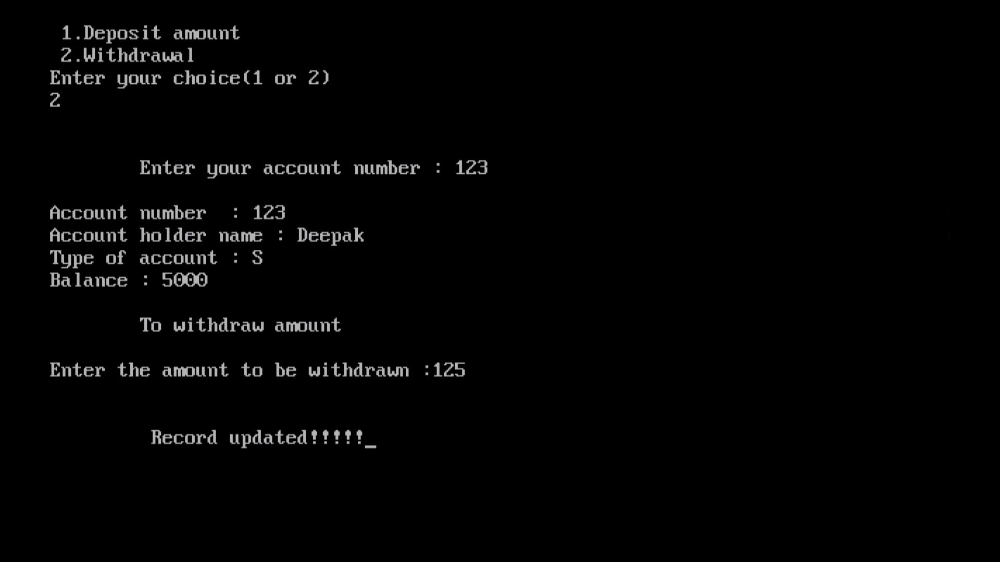

# Banking Project

## Introduction:

This project, originally created in 2015 as part of an intermediate level course, serves as an introduction to the workings of a banking system. It offers a basic understanding of the key features found in a typical banking management system.

## Features:

1: New Account: Create a new bank account.

2: List of Account Holders: View a list of all account holders.

3: Individual Account Status: Check the status of a specific account.

4: Daily Transactions (Deposit/Withdraw): Perform daily transactions, including deposits and withdrawals.

5: Edit Account (Modify/Delete): Modify or delete existing accounts.

6: This project provides a simplified representation of a banking management system.

## Team Members (2015-2016):

Deepak Kumar Pandey (XII A1)

Chandraprakash Chaubey (XII A1)

Sawan Kumar Pal (XII A1)

Nishant Srivastava (XII A1)

## Getting Started:

### To use our program, follow these steps:

Copy the file named "BANKING.CPP" to your C++ program location.

Open Turbo C++ and load the "BANKING.CPP" file.

Press Ctrl+F9 to run the program.

You can also find screenshots of the program's output in the provided CD.

# Screenshots of the outscreen:

This project serves as an educational tool to understand the basics of a banking management system. It was developed by a team of dedicated students during the 2015-2016 session.

